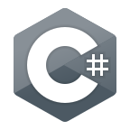
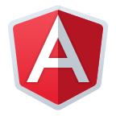

<link rel="stylesheet" href="./styles.css">

Full Stack Developer 
 

## Contact

- Email : juanjocpalencia@gmail.com
- Phone : +52 444 281 4750
- Linked in: [juanjocpalencia](http://linkedin.com/in/Juanjocpalencia)

 &nbsp;&nbsp;&nbsp;&nbsp;&nbsp;&nbsp;&nbsp;&nbsp;&nbsp;&nbsp;&nbsp;&nbsp;&nbsp;&nbsp;&nbsp;&nbsp;&nbsp;&nbsp;&nbsp;&nbsp;&nbsp;&nbsp;&nbsp;&nbsp;&nbsp;&nbsp;&nbsp;&nbsp;&nbsp;&nbsp;&nbsp;&nbsp;&nbsp;&nbsp;&nbsp;&nbsp;&nbsp;&nbsp; &nbsp;&nbsp;&nbsp;&nbsp;&nbsp;&nbsp;&nbsp;&nbsp;&nbsp;&nbsp;&nbsp;&nbsp;&nbsp;&nbsp;&nbsp;&nbsp;&nbsp;&nbsp;&nbsp;&nbsp;&nbsp;&nbsp;&nbsp;&nbsp;&nbsp;&nbsp;&nbsp;&nbsp;&nbsp;&nbsp;&nbsp;&nbsp;&nbsp;&nbsp;&nbsp;&nbsp;&nbsp;&nbsp;  

## About me 
Information technology engineer with the aim of creating optimal solutions to everyday problems, with the help of software development tools.
 
 

## Programming Languages

&nbsp;&nbsp;&nbsp;&nbsp;&nbsp;&nbsp;

&nbsp;&nbsp;&nbsp;&nbsp;&nbsp;&nbsp;

&nbsp;&nbsp;&nbsp;&nbsp;&nbsp;&nbsp;

&nbsp;&nbsp;&nbsp;&nbsp;&nbsp;&nbsp;

&nbsp;&nbsp;&nbsp;&nbsp;&nbsp;&nbsp;

&nbsp;&nbsp;&nbsp;&nbsp;&nbsp;&nbsp;

&nbsp;&nbsp;&nbsp;&nbsp;&nbsp;&nbsp;
 

## Frameworks
### Frontend

&nbsp;&nbsp;&nbsp;&nbsp;&nbsp;&nbsp;

&nbsp;&nbsp;&nbsp;&nbsp;&nbsp;&nbsp;

### Backend 
&nbsp;&nbsp;&nbsp;&nbsp;&nbsp;&nbsp;  &nbsp;&nbsp;&nbsp;

## Databases
 &nbsp;&nbsp;&nbsp;   &nbsp;&nbsp;&nbsp; 

## Control versions

&nbsp;&nbsp;&nbsp;&nbsp;&nbsp;&nbsp;

## Services
 &nbsp;&nbsp;&nbsp;
&nbsp;&nbsp;&nbsp;
 &nbsp;&nbsp;&nbsp;

## Professional Experience

### <strong>Software Developer</strong> 
*<strong>Tecnolika</strong> | June 2022 - January 2023*
- Rest API developmnet with netcore 6 
- Data bases Managemetn with SQL Server Management
- Management of IIS Windows Server 
- Application development with React / Angular

### <strong>Web Department Leader</strong> 
*<strong>Fyware</strong> | January 2021 -  June 2022*
- Application development with Python
- Google cloud server management
- Web development department leadership
- Task management with Atlassian Jira

### <strong>Full Stack Developer</strong>
*<strong>Fyware</strong> | April 2021 -  January 2022*
- Web application development with Vue js
- Rest api development with Node express js
- Mongodb Database Management
- Management of Node Linux servers

### <strong>Full Stack Developer</strong>
*<strong>LOAR Mecatronica</strong> | June 2020 - January 2021*
- Web application development with Vue js
- Rest api development with Node express js
- Mongodb Database Management
- Management of Node Linux servers

### <strong>IT Analyst Training</strong>
*<strong>General Motors de Mexico</strong> | April 2019 - March 2020*
- Training data analysis
- Training database management
- Development of an application in Vba for the optimization of the creation of licenses for maintenance technicians
- Implementation of Software for the evaluation of training exams
- Department Support

### <strong>Freelance</strong>
*<strong>Independent Projects</strong>*
- Managing EC2 with Windows Server on AWS
- IIS Server Mount
- ASP.NET Application Deployment
- SQL Server management in AWS service

## Languages
- <strong> Spanish</strong>   *Native*
- <strong> English</strong>   *Certification Cambridge B1*

## Certifications
 

- Cambridge B1
- It essentials
- Office specialist

## Studies

- <strong> Information Technology Engineer</strong>   *Universidad Politecnica de San Luis Potosi*

- <strong> IT technician</strong>  *Colegio de Bachilleres Plantel 28*

# Links
All the Icons are provided by <a target="_blank" href="https://icons8.com">Icons8</a>